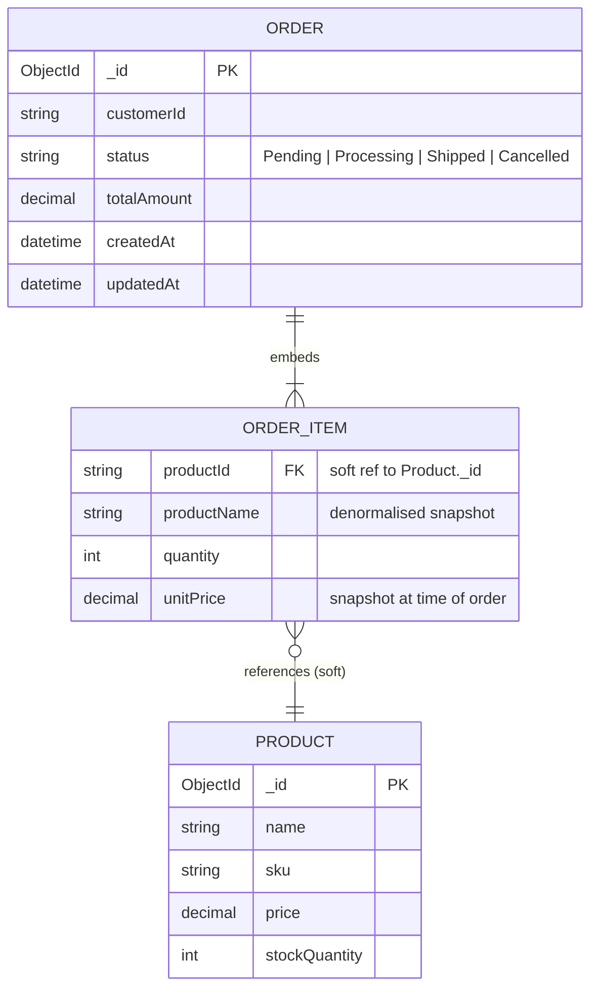

# Commerce Hub — Entity Relationship Diagram

> MongoDB uses two collections: **Orders** and **Products**.
> `OrderItem` is not a separate collection — it is embedded directly inside each `Order` document.
> The link from `OrderItem.productId` to `Product._id` is a soft reference (no enforced foreign key).

## Notes

| Point | Detail |
|---|---|
| `ORDER_ITEM` is embedded | Stored as an array inside the `Order` document, not a separate collection |
| `productName` and `unitPrice` are snapshots | Copied from `Product` at checkout time — changing a product later does not affect existing orders |
| `productId` is a soft reference | MongoDB does not enforce referential integrity; if a product were deleted, old order items would still retain their snapshot data |
| `stockQuantity` is the only mutable product field | Adjusted atomically via `FindOneAndUpdateAsync` with a `$gte` filter guard |
