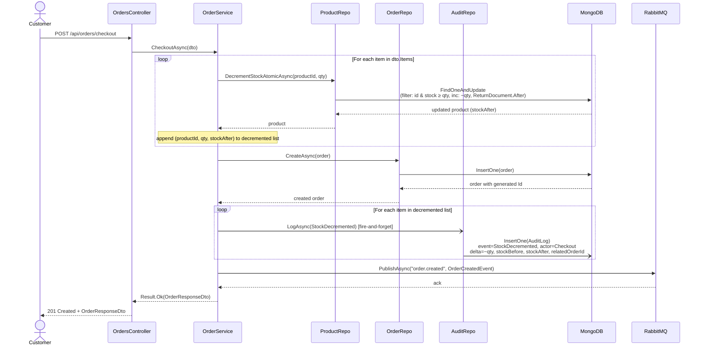
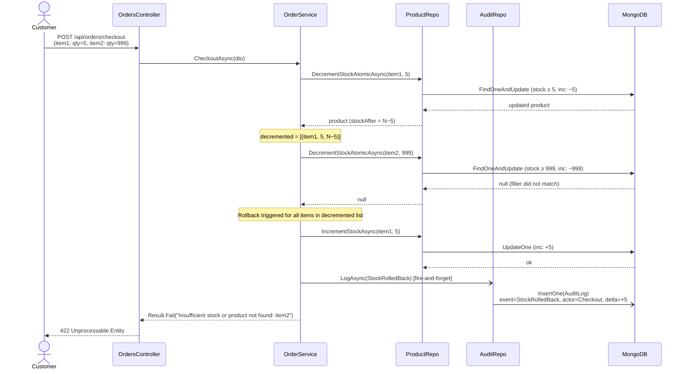
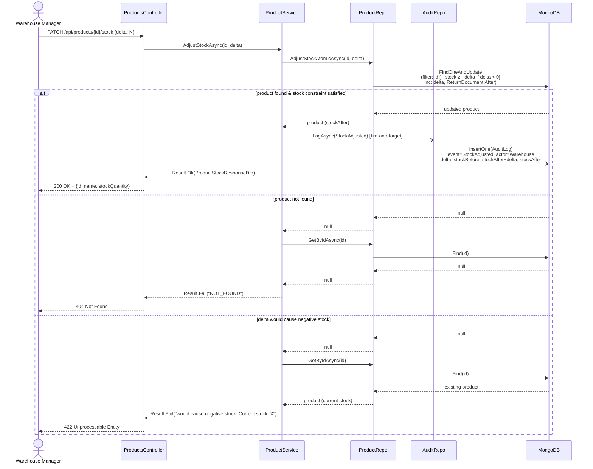
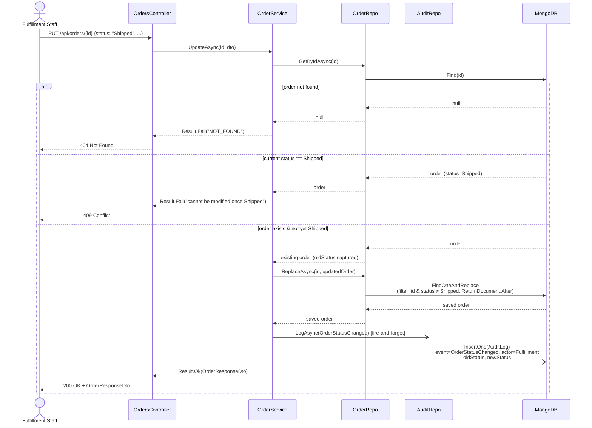
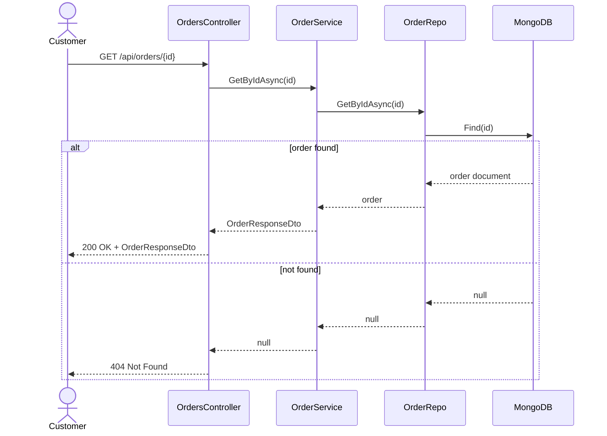
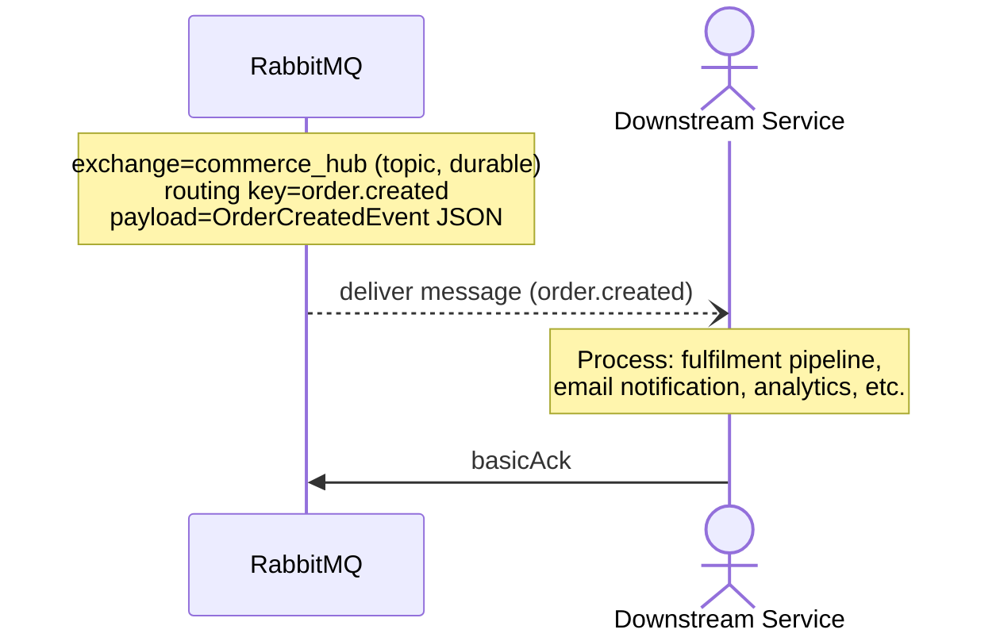

# Commerce Hub — Sequence Diagrams

Five distinct operation types are supported. Each diagram shows the full call stack from
external actor through controller → service → repository → MongoDB/RabbitMQ, including
the fire-and-forget audit writes added in the latest implementation.

---

## 1. Successful Checkout

`POST /api/orders/checkout` where every item has sufficient stock.

---

## 2. Failed Checkout — Insufficient Stock / Product Not Found

`POST /api/orders/checkout` where a later item's atomic decrement returns null.
All previously decremented stock is rolled back.

---

## 3. Stock Adjustment (Warehouse)

`PATCH /api/products/{id}/stock` — warehouse manager restocks or manually decrements inventory.

---

## 4. Order Status Update (Fulfillment)

`PUT /api/orders/{id}` — fulfillment staff advances an order through its lifecycle.

---

## 5. Get Order by ID

`GET /api/orders/{id}` — customer or fulfillment staff polls order state.

---

## 6. Downstream Event Consumption

After a successful checkout, an `OrderCreated` event is published to RabbitMQ.
Any downstream service bound to the `commerce_hub` exchange can consume it.

