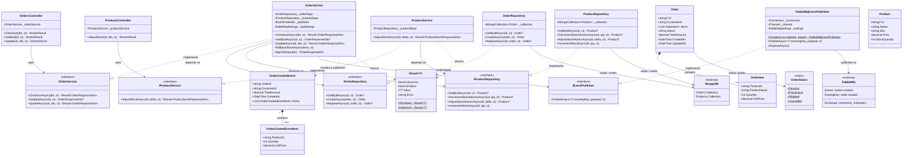

# Commerce Hub — UML Class Diagram

```mermaid
classDiagram
    %% ── Controllers ──────────────────────────────────────────────
    class OrdersController {
        -IOrderService _orderService
        +Checkout(dto, ct) IActionResult
        +GetById(id, ct) IActionResult
        +Update(id, dto, ct) IActionResult
    }

    class ProductsController {
        -IProductService _productService
        +AdjustStock(id, dto, ct) IActionResult
    }

    %% ── Interfaces ───────────────────────────────────────────────
    class IOrderService {
        <<interface>>
        +CheckoutAsync(dto, ct) Result~OrderResponseDto~
        +GetByIdAsync(id, ct) OrderResponseDto?
        +UpdateAsync(id, dto, ct) Result~OrderResponseDto~
    }

    class IProductService {
        <<interface>>
        +AdjustStockAsync(id, delta, ct) Result~ProductStockResponseDto~
    }

    class IOrderRepository {
        <<interface>>
        +GetByIdAsync(id, ct) Order?
        +CreateAsync(order, ct) Order
        +ReplaceAsync(id, order, ct) Order?
    }

    class IProductRepository {
        <<interface>>
        +GetByIdAsync(id, ct) Product?
        +DecrementStockAtomicAsync(id, qty, ct) Product?
        +AdjustStockAtomicAsync(id, delta, ct) Product?
        +IncrementStockAsync(id, qty, ct)
    }

    class IEventPublisher {
        <<interface>>
        +PublishAsync~T~(routingKey, payload, ct)
    }

    %% ── Services ─────────────────────────────────────────────────
    class OrderService {
        -IOrderRepository _orderRepo
        -IProductRepository _productRepo
        -IEventPublisher _publisher
        -RabbitMqSettings _mqSettings
        +CheckoutAsync(dto, ct) Result~OrderResponseDto~
        +GetByIdAsync(id, ct) OrderResponseDto?
        +UpdateAsync(id, dto, ct) Result~OrderResponseDto~
        -RollbackStockAsync(items, ct)
        -MapToDto(order) OrderResponseDto
    }

    class ProductService {
        -IProductRepository _productRepo
        +AdjustStockAsync(id, delta, ct) Result~ProductStockResponseDto~
    }

    %% ── Repositories ─────────────────────────────────────────────
    class OrderRepository {
        -IMongoCollection~Order~ _collection
        +GetByIdAsync(id, ct) Order?
        +CreateAsync(order, ct) Order
        +ReplaceAsync(id, order, ct) Order?
    }

    class ProductRepository {
        -IMongoCollection~Product~ _collection
        +GetByIdAsync(id, ct) Product?
        +DecrementStockAtomicAsync(id, qty, ct) Product?
        +AdjustStockAtomicAsync(id, delta, ct) Product?
        +IncrementStockAsync(id, qty, ct)
    }

    %% ── Messaging ────────────────────────────────────────────────
    class RabbitMqEventPublisher {
        -IConnection _connection
        -IChannel _channel
        -RabbitMqSettings _settings
        +CreateAsync(settings, logger) RabbitMqEventPublisher$
        +PublishAsync~T~(routingKey, payload, ct)
        +DisposeAsync()
    }

    %% ── Domain Models ────────────────────────────────────────────
    class Order {
        +string? Id
        +string CustomerId
        +List~OrderItem~ Items
        +string Status
        +decimal TotalAmount
        +DateTime CreatedAt
        +DateTime UpdatedAt
    }

    class OrderItem {
        +string ProductId
        +string ProductName
        +int Quantity
        +decimal UnitPrice
    }

    class Product {
        +string? Id
        +string Name
        +string Sku
        +decimal Price
        +int StockQuantity
    }

    class OrderStatus {
        <<static>>
        +Pending$
        +Processing$
        +Shipped$
        +Cancelled$
    }

    %% ── Events ───────────────────────────────────────────────────
    class OrderCreatedEvent {
        +string OrderId
        +string CustomerId
        +decimal TotalAmount
        +DateTime CreatedAt
        +List~OrderCreatedEventItem~ Items
    }

    class OrderCreatedEventItem {
        +string ProductId
        +int Quantity
        +decimal UnitPrice
    }

    %% ── Common ───────────────────────────────────────────────────
    class Result~T~ {
        +bool IsSuccess
        +bool IsFailure
        +T? Value
        +string Error
        +Ok(value)$ Result~T~
        +Fail(error)$ Result~T~
    }

    %% ── External Systems ─────────────────────────────────────────
    class MongoDB {
        <<external>>
        Orders Collection
        Products Collection
    }

    class RabbitMQ {
        <<external>>
        Exchange: commerce_hub (topic)
        Queue: orders.created
        RoutingKey: order.created
    }

    %% ── Relationships ────────────────────────────────────────────

    %% Controller → Interface
    OrdersController --> IOrderService : uses
    ProductsController --> IProductService : uses

    %% Implementations
    OrderService ..|> IOrderService : implements
    ProductService ..|> IProductService : implements
    OrderRepository ..|> IOrderRepository : implements
    ProductRepository ..|> IProductRepository : implements
    RabbitMqEventPublisher ..|> IEventPublisher : implements

    %% Service dependencies
    OrderService --> IOrderRepository : depends on
    OrderService --> IProductRepository : depends on
    OrderService --> IEventPublisher : depends on
    ProductService --> IProductRepository : depends on

    %% Model composition
    Order "1" *-- "many" OrderItem : contains
    OrderCreatedEvent "1" *-- "many" OrderCreatedEventItem : contains
    Order --> OrderStatus : status values

    %% Service → Event
    OrderService ..> OrderCreatedEvent : creates & publishes

    %% Service → Result
    OrderService ..> Result~T~ : returns
    ProductService ..> Result~T~ : returns

    %% Infrastructure → External
    OrderRepository --> MongoDB : reads / writes
    ProductRepository --> MongoDB : reads / writes
    RabbitMqEventPublisher --> RabbitMQ : publishes to
```
