# Commerce Hub — Use Case Diagrams

Four user types interact with the Commerce Hub system. Because the API is currently unauthenticated, these represent intended **conceptual roles** rather than enforced access tiers.

| Actor | Primary Concern |
|---|---|
| Customer | Placing and tracking orders |
| Warehouse Manager | Managing product stock levels |
| Fulfillment Staff | Updating order status through fulfilment |
| Downstream Service | Consuming order events from RabbitMQ |

---

## 1. Customer

A customer submits orders and tracks their status. The checkout flow internally coordinates stock checks, atomic inventory reservation, and event publication — but from the customer's perspective these are implementation details of a single "Place Order" action.

```mermaid
flowchart LR
    Customer(["👤 Customer"])

    subgraph CommerceHub["Commerce Hub System"]
        direction TB
        UC1(["Place Order"])
        UC2(["View Order Details"])

        subgraph checkout["Checkout internals (<<include>>)"]
            direction TB
            UC3(["Verify Stock Availability"])
            UC4(["Atomically Reserve Inventory"])
            UC5(["Create Order Record"])
            UC6(["Publish OrderCreated Event"])
        end
    end

    Customer --> UC1
    Customer --> UC2

    UC1 -->|"<<include>>"| UC3
    UC1 -->|"<<include>>"| UC4
    UC1 -->|"<<include>>"| UC5
    UC1 -->|"<<include>>"| UC6
```

**Endpoints used:**

| Use Case | Endpoint |
|---|---|
| Place Order | `POST /api/orders/checkout` |
| View Order Details | `GET /api/orders/{id}` |

**Business rules visible to the Customer:**
- Order is rejected (`422`) if any item has zero or negative quantity.
- Order is rejected (`422`) if any product has insufficient stock.
- If a mid-checkout stock failure occurs, all previously reserved units are automatically rolled back before the error is returned.

---

## 2. Warehouse Manager

A warehouse manager controls product inventory. The single `PATCH /api/products/{id}/stock` endpoint handles both restocking and manual decrements via a signed `delta` value.

```mermaid
flowchart LR
    WM(["🏭 Warehouse Manager"])

    subgraph CommerceHub["Commerce Hub System"]
        direction TB
        UC1(["Adjust Product Stock"])
        UC2(["Restock Product"])
        UC3(["Manually Decrement Stock"])
    end

    WM --> UC2
    WM --> UC3

    UC2 -->|"<<extend>>\ndelta > 0"| UC1
    UC3 -->|"<<extend>>\ndelta < 0"| UC1
```

**Endpoints used:**

| Use Case | Endpoint |
|---|---|
| Adjust Product Stock | `PATCH /api/products/{id}/stock` |

**Business rules:**
- `delta` of `0` is always rejected (`422`).
- A negative `delta` that would push stock below zero is rejected (`422`); current stock is included in the error message.
- All adjustments are atomic (MongoDB `FindOneAndUpdateAsync` with a `$gte` filter guard).
- Returns `404` if the product ID does not exist.

---

## 3. Fulfillment Staff

Fulfillment staff update orders as they progress through the fulfilment pipeline. A full replacement (`PUT`) is used; partial patching is not supported. A key constraint prevents any modification once an order has reached `Shipped` status.

```mermaid
flowchart LR
    FS(["📦 Fulfillment Staff"])

    subgraph CommerceHub["Commerce Hub System"]
        direction TB
        UC1(["View Order Details"])
        UC2(["Update Order"])
        UC3(["Block Modification\nof Shipped Order"])
    end

    FS --> UC1
    FS --> UC2

    UC3 -->|"<<extend>>\nstatus == Shipped"| UC2
```

**Endpoints used:**

| Use Case | Endpoint |
|---|---|
| View Order Details | `GET /api/orders/{id}` |
| Update Order | `PUT /api/orders/{id}` |

**Business rules:**
- `PUT` is an idempotent full replacement — all writable fields must be supplied.
- Returns `404` if the order does not exist.
- Returns `409 Conflict` if the order status is already `Shipped`; the guard is enforced at both the service layer and the MongoDB `ReplaceAsync` filter, protecting against race conditions.
- Valid status transitions: `Pending` → `Processing` → `Shipped`.

---

## 4. Downstream Service (Message Consumer)

An external service or worker subscribes to the RabbitMQ topic exchange and processes `OrderCreated` events asynchronously. This actor does not call the HTTP API directly; it interacts solely through the message broker.

**Event payload (`OrderCreatedEvent`):**

| Field | Description |
|---|---|
| `orderId` | Unique ID of the created order |
| `customerId` | Customer who placed the order |
| `totalAmount` | Total order value |
| `createdAt` | UTC timestamp |
| `items[]` | Product ID, quantity, and unit price per line |

**Design notes:**
- Messages are **persistent** and the exchange is **durable**, surviving broker restarts.
- Event publication is **best-effort**: if publishing fails after the order is committed to MongoDB, the order is not rolled back. A production implementation would use an **outbox pattern** to guarantee delivery.
- Routing key: `orders.created` on a topic exchange named per `RabbitMqSettings`.

---

## Combined Actor Overview

```mermaid
flowchart TD
    C(["👤 Customer"])
    WM(["🏭 Warehouse Manager"])
    FS(["📦 Fulfillment Staff"])
    DS(["⚙️ Downstream Service"])

    subgraph API["Commerce Hub HTTP API"]
        O1(["POST /api/orders/checkout"])
        O2(["GET  /api/orders/{id}"])
        O3(["PUT  /api/orders/{id}"])
        P1(["PATCH /api/products/{id}/stock"])
    end

    subgraph Broker["RabbitMQ"]
        E1(["orders.created event"])
    end

    C  --> O1
    C  --> O2
    FS --> O2
    FS --> O3
    WM --> P1

    O1 -->|publishes| E1
    DS --> E1
```

